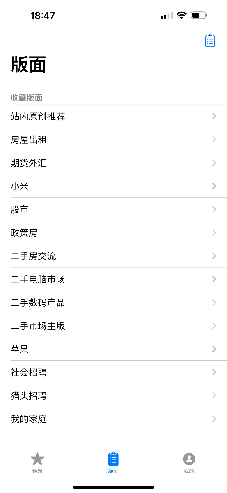
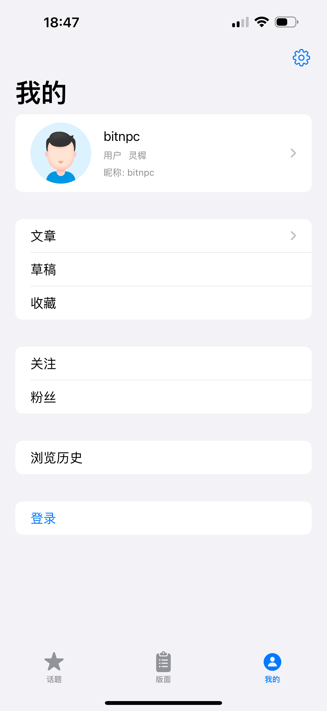

# Smth

SwiftUI 打造的水木社区多端客户端（iOS / iPadOS / macOS）。2025 重构版围绕 MVVM + Repository 架构，补齐依赖注入、分页与多平台适配策略。

## 功能亮点
- 热门话题瀑布流 & 分页加载
- 版面/子版面层级导航
- 话题详情与楼层楼主视图
- 个人中心、文章列表与登录入口
- iPad / macOS 自适应三栏导航体验

## 架构总览
- `App/Core`: 公共能力，含 `Networking`（`APIService`、`APIRouter`、`ForumAPI`）、`Repository` 与 `Dependency` 容器。
- `App/Modules`: 以业务域拆分的 MVVM 模块（Home、Section、Profile 等），每个模块暴露 View + ViewModel。
- `App/Components`: 跨模块复用的 UI 组件（列表容器、WebView 等）。
- `App/Model`: 领域模型与 DTO。
- `SmthTests`: 基于 `XCTest` 的 ViewModel 单测示例。

### MVVM + DI
- `AppContainer` 负责注入 `APIService` 与各类 Repository，实现 ViewModel 按需获取依赖。
- View 通过可注入的 `StateObject` 使用 ViewModel，便于预览与单测替换。
- Repository 层统一抛出 `AppError`，ViewModel 负责状态管理（加载、错误、刷新、分页）。

### 多平台适配
- `ContentView` 根据 Size Class / 平台切换 `TabView` 与 `NavigationSplitView`，在 iPad 和 macOS 上提供侧边栏体验。
- Home 模块采用响应式布局（网格 + 列表）兼容不同屏幕尺寸。
- 公共组件统一管理列表样式、背景与悬浮提示，减少平台分支。

## 开发指南
```bash
# 格式 & 静态检查
swiftlint --config swiftlint.yml

# 编译 / 单测（需本地安装 Xcode 及模拟器）
xcodebuild -scheme Smth -project Smth.xcodeproj \
  -destination 'platform=iOS Simulator,name=iPhone 15' \
  build

# CI（Fastlane 封装 lint + test）
bundle exec fastlane ci
```

> 如在 CI 或沙箱环境构建失败，请手动安装所需模拟器并给予对 `~/Library` 目录的访问权限。

## 截图
| 话题 | 版面 | 我的 |
| --- | --- | --- |
|  |  |  |

