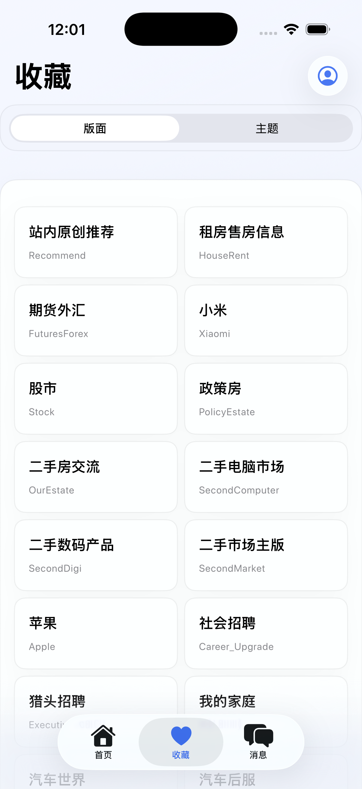
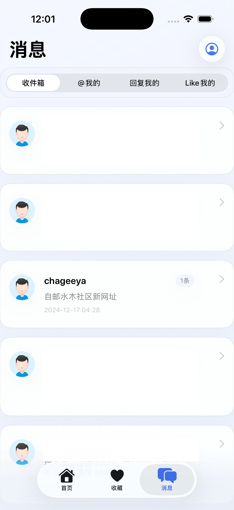
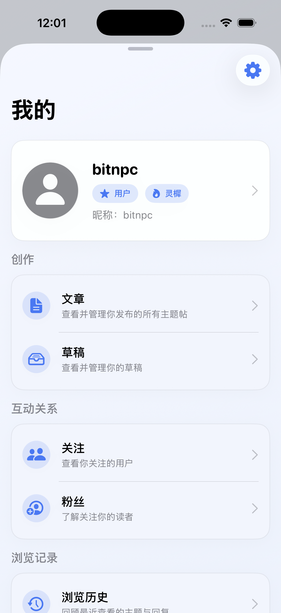
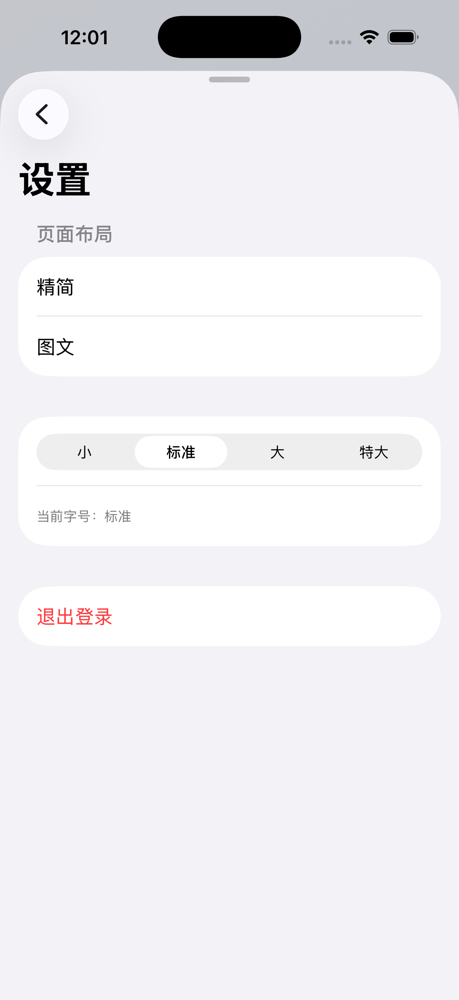
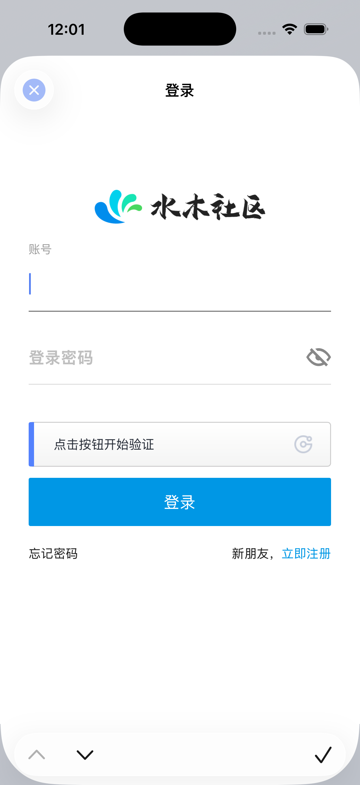

# Smth

> A modern SwiftUI client for NewSMTH forum (iOS / iPadOS / macOS). Built with MVVM + Repository architecture, featuring dependency injection, pagination support, and seamless multi-platform compatibility.

> 基于 SwiftUI 打造的水木社区多端客户端（iOS / iPadOS / macOS）。采用 MVVM + Repository 架构，支持依赖注入、分页加载和多平台适配。

## 📱 Features / 功能亮点

### Core Features / 核心功能
- ✅ **Topic Browsing** - Hot topics with pagination
- ✅ **Board Navigation** - Hierarchical board/sub-board navigation
- ✅ **Topic Details** - Complete topic content and replies
- ✅ **User Login** - WebView-based authentication
- ✅ **Favorites** - Favorite boards and topics management
- ✅ **Messages** - Inbox, mentions, replies, and likes
- ✅ **Profile** - User profile, topics, drafts, followers/following, browsing history
- ✅ **Search** - Board and topic search

- ✅ **热门话题浏览** - 瀑布流展示，支持分页加载
- ✅ **版面导航** - 层级式版面/子版面导航
- ✅ **话题详情** - 完整的话题内容与楼层回复展示
- ✅ **用户登录** - 基于 WebView 的登录认证
- ✅ **收藏管理** - 收藏版面与话题，支持分类查看
- ✅ **消息中心** - 收件箱、@我的、回复我的、Like我的
- ✅ **个人中心** - 个人资料、我的话题、草稿、关注/粉丝、浏览历史
- ✅ **搜索功能** - 版面与话题搜索

### User Experience / 用户体验
- 🎨 Modern UI with unified theme system and dark mode
- 📱 Native experience on iOS, iPadOS, and macOS
- 🔄 Responsive layout for different screen sizes
- ⚡ Optimized loading states and error handling
- 💾 Local caching for browsing history and drafts

- 🎨 **现代化 UI** - 统一的主题系统，支持深色模式
- 📱 **多平台适配** - iOS、iPadOS、macOS 原生体验
- 🔄 **响应式布局** - 自适应不同屏幕尺寸
- ⚡ **流畅交互** - 优化的加载状态与错误处理
- 💾 **本地缓存** - 浏览历史与草稿本地存储

## 🏗️ Architecture / 项目架构

Built with **MVVM + Repository** pattern:

```
View (SwiftUI) → ViewModel → Repository → APIService
```

采用 **MVVM + Repository** 架构模式：

```
View (SwiftUI) → ViewModel → Repository → APIService
```

### Key Components / 核心组件

- **Core**: Authentication, Database, Dependency Injection, Networking, Utils
- **Modules**: Home, Favorite, Message, Profile, Search (MVVM structure)
- **Components**: Reusable UI components
- **Model**: Data models and DTOs

- **Core**: 认证、数据库、依赖注入、网络层、工具类
- **Modules**: 首页、收藏、消息、个人中心、搜索（MVVM 结构）
- **Components**: 可复用 UI 组件
- **Model**: 数据模型和 DTO

### Multi-Platform Support / 多平台适配

- **iOS**: TabView navigation
- **iPadOS**: NavigationSplitView with sidebar
- **macOS**: NavigationSplitView with sidebar and content area

- **iOS**: TabView 底部导航
- **iPadOS**: NavigationSplitView 侧边栏布局
- **macOS**: NavigationSplitView 侧边栏 + 内容区

## 📸 Screenshots / 应用截图

| Home / 首页 | Favorites / 收藏 | Messages / 消息 |
|-------------|------------------|-----------------|
|  |  |  |

| Profile / 个人中心 | Settings / 设置 | Login / 登录 |
|-------------------|-----------------|--------------|
|  |  |  |

## 🎯 Implemented Features / 已实现功能

### Home Module / 首页模块
- [x] Hot topics list with pagination
- [x] Board selector
- [x] Topic detail page
- [x] Article replies display
- [x] Image attachments
- [x] Pull to refresh

- [x] 热门话题列表（瀑布流）
- [x] 版面选择器
- [x] 话题详情页
- [x] 文章回复展示
- [x] 图片附件展示
- [x] 下拉刷新

### Favorite Module / 收藏模块
- [x] Favorite boards and topics
- [x] Board/topic switching
- [x] Hierarchical board navigation

- [x] 收藏版面列表
- [x] 收藏话题列表
- [x] 版面/话题切换
- [x] 版面层级导航

### Message Module / 消息模块
- [x] Inbox, mentions, replies, likes
- [x] Conversation details
- [x] Message pagination

- [x] 收件箱、@我的、回复我的、Like我的
- [x] 会话详情
- [x] 消息分页加载

### Profile Module / 个人中心模块
- [x] User login (WebView)
- [x] Profile display
- [x] My topics, drafts
- [x] Followers/following lists
- [x] Browsing history
- [x] Settings

- [x] 用户登录（WebView）
- [x] 个人资料展示
- [x] 我的话题列表
- [x] 草稿管理
- [x] 关注列表
- [x] 粉丝列表
- [x] 浏览历史
- [x] 设置页面

### Search Module / 搜索模块
- [x] Board and topic search

- [x] 版面搜索
- [x] 话题搜索

### Common Features / 通用功能
- [x] Image caching
- [x] Local storage (browsing history)
- [x] Font size settings
- [x] Dark mode support
- [x] Error handling and retry

- [x] 图片缓存
- [x] 浏览历史本地存储
- [x] 字体大小设置
- [x] 深色模式支持
- [x] 错误处理与重试

## 🚧 Planned Features / 待实现功能

### Content Interaction / 内容交互
- [ ] Page navigation (prev/next page)
- [ ] Post new topics
- [ ] Reply to topics and posts
- [ ] Like/unlike functionality

- [ ] **翻页功能** - 话题详情页的翻页导航（上一页/下一页）
- [ ] **发帖功能** - 发布新话题
- [ ] **评论功能** - 回复话题和楼层
- [ ] **点赞功能** - 对话题和回复进行点赞/取消点赞

### Social Features / 社交功能
- [ ] Follow/unfollow users
- [ ] Blacklist management

- [ ] **关注功能** - 关注/取消关注用户（目前仅支持查看关注列表）
- [ ] **黑名单功能** - 管理黑名单用户

### Account Management / 账户管理
- [ ] Change password
- [ ] Bind phone number

- [ ] **修改密码** - 账户密码修改
- [ ] **绑定手机号** - 手机号绑定与验证

### Other Features / 其他功能
- [ ] Edit/delete posts
- [ ] Report content
- [ ] Private messages
- [ ] Push notifications

- [ ] **编辑帖子** - 编辑已发布的帖子
- [ ] **删除帖子** - 删除自己发布的帖子
- [ ] **举报功能** - 举报不当内容
- [ ] **私信功能** - 用户间私信交流
- [ ] **推送通知** - 消息推送提醒

## 🖥️ Platform Support / 平台适配

| Platform / 平台 | Min Version / 最低版本 | Status / 状态 |
|----------------|----------------------|--------------|
| iOS | 18.0+ | ✅ Fully Supported / 完全支持 |
| iPadOS | 18.0+ | ✅ Fully Supported / 完全支持 |
| macOS | 15.0+ | ✅ Fully Supported / 完全支持 |

## 🚀 Quick Start / 快速开始

### Requirements / 环境要求

- Xcode 15.0+
- Swift 5.9+
- iOS 18.0+ / macOS 15.0+

### Installation / 安装步骤

```bash
# Clone the repository
git clone <repository-url>
cd Smth

# Open in Xcode
open Smth.xcodeproj

# Build and run (Cmd + R)
```

```bash
# 克隆项目
git clone <repository-url>
cd Smth

# 打开项目
open Smth.xcodeproj

# 构建并运行 (Cmd + R)
```

Dependencies are managed via Swift Package Manager and will be automatically resolved.

依赖通过 Swift Package Manager 管理，会自动下载。

### Development / 开发指南

```bash
# Code linting
swiftlint --config swiftlint.yml

# Build
xcodebuild -scheme Smth -project Smth.xcodeproj \
  -destination 'platform=iOS Simulator,name=iPhone 16' build

# Run tests
xcodebuild test -scheme Smth -destination 'platform=iOS Simulator,name=iPhone 16'
```

```bash
# 代码规范检查
swiftlint --config swiftlint.yml

# 构建项目
xcodebuild -scheme Smth -project Smth.xcodeproj \
  -destination 'platform=iOS Simulator,name=iPhone 16' build

# 运行测试
xcodebuild test -scheme Smth -destination 'platform=iOS Simulator,name=iPhone 16'
```

## 📦 Dependencies / 依赖管理

- **SwiftSoup** (2.6.1) - HTML parsing / HTML 解析
- **Alamofire** (5.8.0) - HTTP networking / HTTP 网络请求

## 🧪 Testing / 测试

- ✅ ViewModel unit tests / ViewModel 单元测试
- ✅ Repository tests / Repository 测试
- ✅ Data model tests / 数据模型测试
- ⏳ UI tests (pending) / UI 测试（待完善）

## 🤝 Contributing / 贡献指南

Contributions are welcome! Please follow these steps:

欢迎贡献代码！请遵循以下步骤：

1. Fork the repository / Fork 项目
2. Create a feature branch (`git checkout -b feature/AmazingFeature`) / 创建功能分支
3. Commit your changes (`git commit -m 'Add some AmazingFeature'`) / 提交更改
4. Push to the branch (`git push origin feature/AmazingFeature`) / 推送到分支
5. Open a Pull Request / 开启 Pull Request

### Code Style / 代码规范

- Follow SwiftLint rules / 遵循 SwiftLint 规则
- Write clear commit messages / 使用清晰的提交信息
- Add tests for new features / 为新功能添加测试

## 📄 License / 许可证

This project is licensed under the MIT License - see the [LICENSE](LICENSE) file for details.

本项目采用 MIT 许可证。详见 [LICENSE](LICENSE) 文件。

## 🙏 Acknowledgments / 致谢

- Thanks to NewSMTH forum / 感谢水木社区论坛
- Thanks to all contributors / 感谢所有贡献者的支持

## 📮 Contact / 联系方式

For questions or suggestions:

如有问题或建议，请通过以下方式联系：

- Open an Issue / 提交 Issue
- Create a Pull Request / 开启 Pull Request
- Email: [bitnpc@gmail.com](mailto:bitnpc@gmail.com) / 发送邮件

---

**Note**: This project is for educational purposes only. Please comply with NewSMTH forum's terms of use.

**注意**: 本项目仅供学习交流使用，请遵守水木社区的使用条款。
